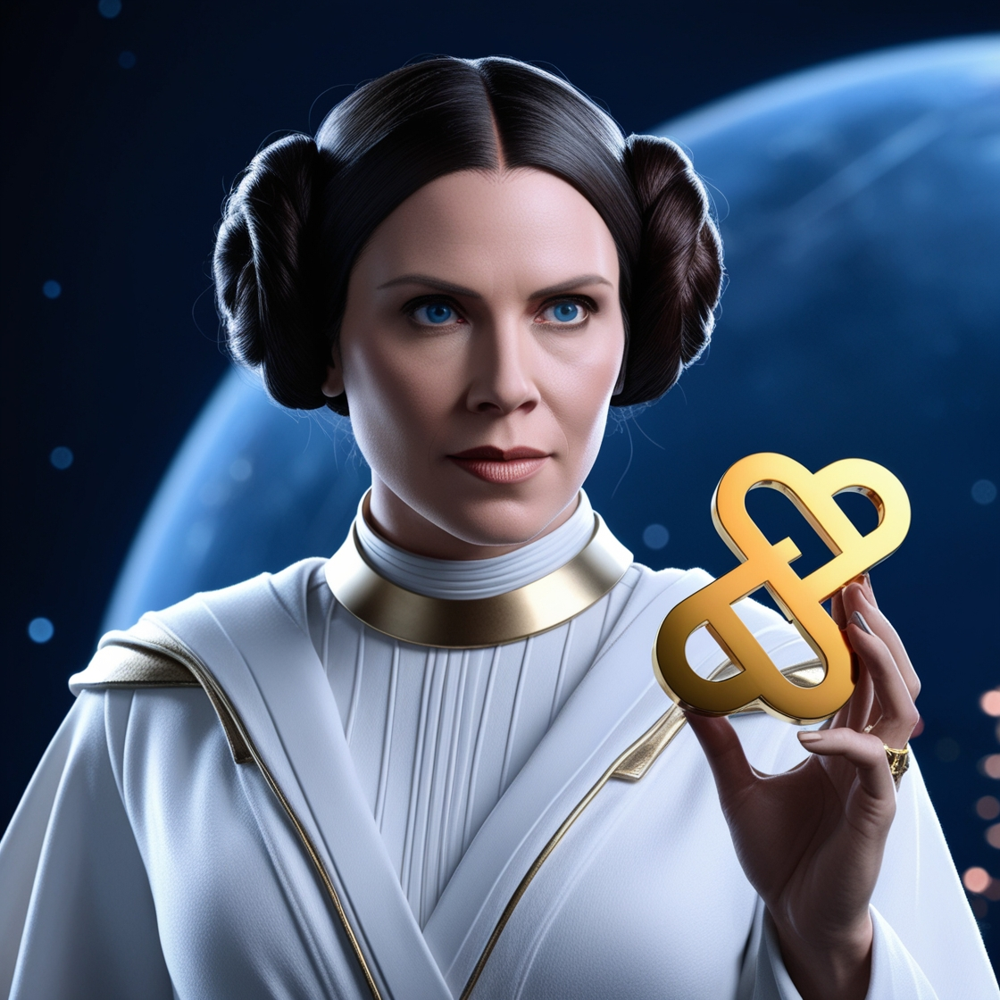

# Projeto EBOOK Gerado por I.A.s

Projeto com o objetivo de gerar um ebook digital com as facilidades das ferramentas de IA. todos os prompts
seguem abaixo.

<a href="https://github.com/Adrigaby/prompts-recipe-to-create-a-ebook/blob/main/output/Ebook%20CSS%20O%20Despertar.pdf" title="View PDF now"> 📕Clique aqui para ler</a>

## 💻 Tecnologias utilizadas no projeto

- [ChatGPT](https://chat.openai.com/) 
- [Leonardo AI](https://app.leonardo.ai/)
- [PowerPoint](https://www.microsoft.com/en/microsoft-365/powerpoint)

## ✨ Features

- Conteúdo gerado via ChatGPT
- Imagens geradas via Leonardo AI

## 📚 Materiais

- Imagens utilizadas em `assets`
- ebook gerado durante as aulas em `output`

## 👨‍💻 Expert

⌨️ com 💜 por [Adriana Campaner](https://github.com/Adrigaby)
